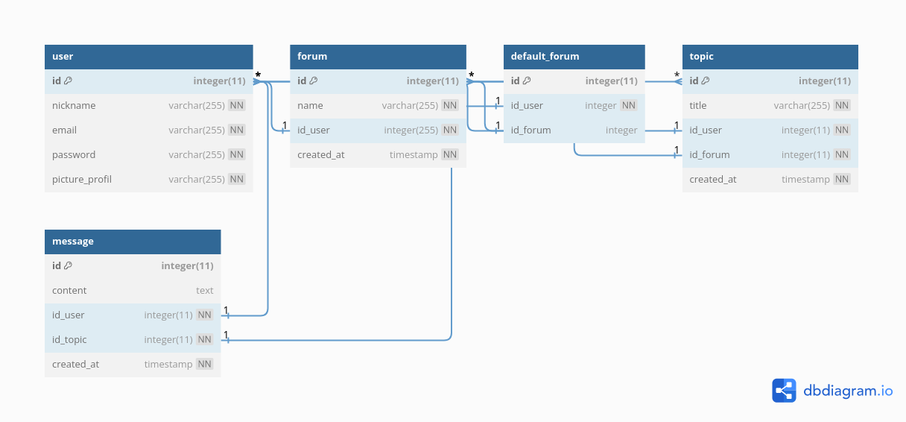

# phpforum

<!-- Add a cover image of the website here -->

## Project Overview

This project is a discussion forum inspired by platforms like Stack Overflow. Users can create topics, participate in discussions, and exchange messages related to specific topics. The forum allows for user registration, authentication, and topic management. It is built using PHP and follows an MVC architecture, with Bootstrap and Bootswatch for styles and responsive design.

**Key Features:**

- User registration and authentication
- Topic creation and management
- Messaging system for discussions
- Responsive design for mobile and desktop users

**Technologies Used:**

- PHP
- MVC architecture
- Bootstrap
- Bootswatch

**User Benefits:**
The forum provides a platform for users to engage in meaningful discussions, seek help, and share knowledge within specific topic areas. It encourages collaboration and learning among its community members.

**Demo:**
Check out the live demo [here](https://your-demo-link.com).

## Development planning

<!-- TODO: if you can, make this section in two columns for more readability -->


- [x] 0. Minimal project setup + README first version
- [x] 1. Database setup
  - paying attention to constraints (can help for cascading deletion), `NULL` by default (or not), etc.
  - protect the database with password safely
- [x] 2. User registration page and theme choice
- [x] 3. User login
- [x] 4. User logout
- [ ] 5. Topic creation form (in the home page)
- [ ] 6. List of all topics on home page
- [ ] 7. Topic deletion
- [ ] 8. Chat page + message deletion
- [ ] 9. Forum creation page
- [ ] 10. List of all forum on home page (with the more dropdown button)
- [ ] 11. Forum deletion
- [ ] 12. User profil
- [ ] 13. User profil management
  - [ ] Topic deletion
  - [ ] Forum deletion
  - [ ] default forum
- [ ] 14. Make default forum loaded when the user is connected
- [ ] 15. Limit account creations from the same IP address (and chose the limit)
- [ ] 16. Choose the limit of users, forums and messages
- [ ] 17. Update README

## Dependancies

- `vlucas/phpdotenv` library for environment variable management (To install with [composer](https://getcomposer.org/download/))

## Installation

<!-- Include step-by-step instructions for setting up the project on a local machine. Specify prerequisites, dependencies, and any configuration needed. -->

**Guide for local install**

1.  Install XAMPP
2.  clone the project within **htdocs/**
3.  create the database from `dbmodel.sql`. Set it up with your own credentatials.
4.  Ensure the web server user, normally `daemon`, has the permission of read & write for the folder `public/upload`. This is important for the profil picture upload feature. You can follow those steps:

    - **Identify the webserver user**:
      Use PHP to identify the web server user by using the posix_getpwuid function:

      ```php
      <?php
      $uid = posix_geteuid();
      $info = posix_getpwuid($uid);
      echo "Web server user: " . $info['name'];
      ?>
      ```

    - **Create a New Group**:
      First, create a new group that both you and the daemon belong to. You can create a group using the groupadd command, for example:

      ```bash
      sudo groupadd phpforum
      ```

    - **Add Users to the Group**:
      Add both your user and the daemon user to the newly created group:

      ```bash
      sudo usermod -aG phpforum your_user_name
      sudo usermod -aG phpforum daemon
      ```

    - **Change Group Ownership**:
      Change the group ownership of the upload directory to the new group (mygroup):

      ```bash
      sudo chown :phpforum public/upload
      ```

      **NB**: if you are running xampp for some reason, restart it to make the changes effective after the latter step.

5.  Launch by running the following steps:
    - Ensure you have xampp running. You can start the process with `/opt/lampp/lampp start`
    - go to http://localhost and go to the **htdocs/** folder, the projects folder. In the project folder, access the **public/** folder. This is the folder where the `index.php` is. The website should load automatically after accessing the **public/** folder.

## Usage

<!--
- Describe how to use the project, including how to navigate the interface, create topics, and send messages.
- Explain user registration and authentication.
- Mention any special features like user profiles, topic deletion, etc.
-->

### Website launching

- if you cloned the project on your local machine, ensure you followed the install steps
- launch xampp and access in your browser the following url: https://localhost/your_project_folder_name/public/
- you can also access the website on live demo throught the following link: [link to demo](https://example.com)

### Navigation

- when you arrive on the homepage, you can view every topics created in the default forum
- the navbar contains a link to the home page and the website logo. Login/logout - sign up button are included in the navbar on the right hand side. When the user is logged, a profile link is shown besides the home page link.
- you can also view links to every created forums between the navbar and the list of topics. Not all links are viewable at first sight. You may have to click on a drop down to display every links

### Topics creation and messages

- To create a topic, you need to be connected. You will see just above the list of created topics a "create" button. Clicking on that button will lead you to topic creation page
- To send a messsage related to a topic, you also need to be connected. Just access a topic, write a message in the text area and send it by clicking on the button.

### Forum creation

- Anybody can create its own forum, as long as it is registered. The website can host up to 20 supplementary forums, for 24h starting the creation time.
- To create a forum, you need to be connected. A button 'Create a forum' will be on display within the "others forum" area.
- Once you click on the button, you will be redirected to a creation page, where you can choose the forum name.
- During the creation, you can asked to make this new forum the default forum when you login

### User registration and authentication

- Registration is done by clicking on the button 'signup', leading to a form. To register, the user needs to provide an email and a password. The use can also provide a profile picture.
- authentication is done by clicking on the button 'login'. Email and password are asked.

### User profil

- When the user is logged, a profile link is besided the home page link. When clicking it, it accesses to the the profile management. The use can view
  - Its profile picture
  - Its name, surename and pseudo
  - A list of created topics
  - A list of created forums. A tag _default_ is along the default forum
- At the bottom, there is a 'change' button to proceed to some changes. When clicking on the button, a special for changes is loaded. Here are the possible changes:
  - delete a created topics (delete button along the name)
  - change default forum (radio button on the names with default in green. When a button is cheked, it is blue with a check symbol inside)
  - delete a forum (delete button along the name)

### Topics, messages and forum deletion

- Topics: a button bellow the topic enable the creator of it to delete it. Topics can also be deleted via the list of topics created on the user profile. Confirmation before deletion.
- Messages: a button bellow the message enable its author to delete it. No confirmation before deletion.
- Forums: a small trash button along the forum name in the list of created forum enables the creator to delete its forum. Confirmation before deletion.

## Screenshots

<!--
- Embed screenshots or GIFs to visually showcase different parts of your application.
- TODO:
   - Select main screenshots to show case
   - create a gallery to let the viewer see more
   -->

### Desktop

_main_

- Home (disconnected)
- Home (connected)
- Topic discussion (disconnected)
- Topic discussion (connected)
- Connection
- Registration
- User settings
- GIF Topic creation
- GIF Topic deletion
- GIF Reveal other forums
- GIF Forum creation
- GIF change default forum

_optional_

### Mobile

_main_

- Home (disconnected)
- Home (connected)
- Topic discussion (disconnected)
- Topic discussion (connected)
- Connection
- Registration
- User settings
- GIF Topic creation
- GIF Topic deletion
- GIF Reveal other forums
- GIF Forum creation
- GIF change default forum

_optional_

## Security Measures

<!-- Briefly mention any security practices you've implemented. -->

- Protection against:
  - SQL injection
  - CSS attacks
- Password hashing

## Technologies Used

<!-- List the technologies and frameworks used in your project. -->

- PHP
- Bootstrap
- Bootswatch themes
- SQL

## Code Organization

<!--
- Briefly explain the organization of your codebase, where to find key files, and how to navigate the structure.
- TODO: include a simplify tree of the project
-->

**base**

The code adopt an Model View Controller (MVC) architecture. The main folders are:

- **config/**: contains the configuration of the web app: database, routes, app name, etc.
- **public/**: contains `index.php`, the main files of the project. This is by this file that the webpage is generated in the browser. The folder also contains the error 404 page and a folder containing uploaded files
- **src/**: contains the controllers and the models (respectivelly in **src/controllers** and **src/models/**). Models are interfaces between the database and the app. Controllers are functions triggered by the web app which perform actions like page loading, database requests, etc.
- **views/**: contains the views of the web app. Views are the webpages of the websites. There are organized within subfolders by common themes / purposes. For example, _user_ related pages, _connection_ related pages, etc.
  - All webpages are structured like so : header - main - footer. The main can vary throughout pages, yet pages have (almost) the same header and footer. Therefore, to follow the DRY principle, the header and footer are coded in separate files within **views/\_partials/** and included with PHP following the structure stated above.

This code structure is directly taken from a course I followed at Doranco on PHP. I then made adjustment to the project requirements if it was necessary.

**Additions**

- `.env` file at the root of the project containing sensitive information like database credentials. The environment are loaded thanks to `vlucas/phpdotenv` library.

## Database architecture

<!-- INSERT HERE the diagram of the db archi -->



The database contains **5 tables**:

- `user`: stores information about the users of the forum, such as their nickname, email address, password and profile picture.
- `forum`: stores information about the forums in the forum, such as their name, creator (user id) and creation date.
- `default_forum`: stores information about the default forums (forum id) of each users (user id). The forum id can be `NULL`, indicating that the user has the original forum as default one.
- `topic`: stores information about the topics in the forum, such as their title, the creator (user id), the forum (forum id) and creation date.
- `message`: stores information about the messages in the forum, such as their content, their author (user id), the related topic (topic id) and the creation date.

**Relationships** between tables are as follows:

- The `user` table has a **one-to-many** relationship with:
  - the `topic` table: this means that each user can create many topics, but each topic can only be created by one user.
  - the `message` table: analog explanations as above.
  - the `forum` table: analog explanations as above.
- the `default_forum` table has:
  - a **one-to-one** relationship with the `user` table. This means that each user has a corresponding and unique entry in the `default_forum` table.
  - a **one-to-many** relationship with the `forum` table. This means that each forum can be set as default for many users, but each users can only have one forum set as default.
- The `forum` table has a **one-to-many** relationship with the `topic` table: this means that each forum can have many topics, but each topic can only belong to one forum.
- The `topic` table has a **one-to-many** relationship with the `message` table: this means that each topic can have many messages, but each message can only belong to one topic.

## Routes structure

Here are the main routes:

- `phpforum/` is the root of the website. This route serves the default forum as homepage
- `phpforum/index.php/` route is equivalent to the route above. Further information: it displays a list of all the topics in the current forum, ordered by the most recent creation date. A list of all accessible forums is also displayed, above the topic list. When a forum ID is passed as a parameter, this refer to the default forum of the connected user. The adequate forum is then displayed.
- `phpforum/chat/`route displays the messages for a specific topic. The topic ID is passed to this route as a parameter.
- `phpforum/user/profil` route displays the user information, such as the topics it created, the forum it created, its default forum, etc. The user ID is passed to this route as a parameter.
- `phpforum/user/setting` route displays the user profile setting version. The page becomes a form.
- `phpforum/topic/add` route is the topic creation page.
- `phpforum/topic/delete` route deletes a topic. The topic ID is passed to this route as a parameter.
- `phpforum/add` route is the forum creation page.
- `phpforum/delete` route deletes a topic. The forum ID is passed to this route as a parameter.
- `phpforum/name_of_a_forum/` route displays the homepage of a hosted forum. The route logic is the same as the original forum, except for `name_of_a_forum` which adds in between.

## Deployment

<!--
- Provide instructions for deploying the project on a web host if applicable.
- If you have a live version, share the URL.
-->

**With a webhost**

- **/!\\ NB \#1:** the `.env` file **MUST NOT** be accessible to the public. It contains sensitive information like database credentials.
- **/!\\ NB \#2:** the `public/upload` folder **MUST BE** be accessible to web server user with read & write rights. Otherwise, the profil picture upload won't work.

- Send the files with filezilla for example
- Integration
  - Incorporate it to an existing domain:
  - Dedicated domain:

**Live version**

Live version of the website is available [here](https://example.com).

## Demo

<!-- If possible, include a link to a live demo of the project. -->

Here is live demo of the project: [live demo](https://example.com).

## Challenges and Solutions

<!--
Share any challenges you faced and how you overcame them during development.
-->

## Future Enhancements

<!-- Mention any planned improvements or features you'd like to add in the future. -->

- adding a pages interface for topics display and messages as well
- Refactor the project with symphony or laravel

## Feedback and Impact

<!--
Share any feedback you've received from users and how the project has made a positive impact.
-->
